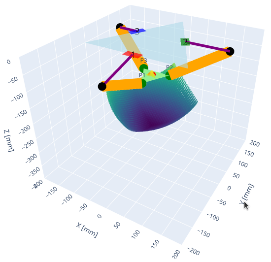

# DeltaRobot
Author: Sharwin Patil (*2025 MSR Winter Project*)

  

# ROS Package Structure

## Trajectory Generator
The `deltarobot_control` package is responsible for generating trajectories for the robot to follow. Currently, some hardcoded trajectories are baked into the package, but the package will be extended to offer parametric trajectory generation, resulting in position-velocity trajectories.

## Kinematics Solver
The `deltarobot_kinematics` package enables several kinematic capabilities for any delta robot. The package accepts a config file that specifies the robot's geometry, link lengths, and joint limits. Forward and Inverse Kinematics are implemented here as well as the Jacobian for creating joint-velocity trajectories from position trajectories.

## Motor Controller
The `deltarobot_motorcontrol` package is responsible for interfacing (using the hardware) with the 3 motors controlling the robot. This package implements
interfacing with dynamixel motors but can be extended to other motor types as long as the inter-node connections are maintained.